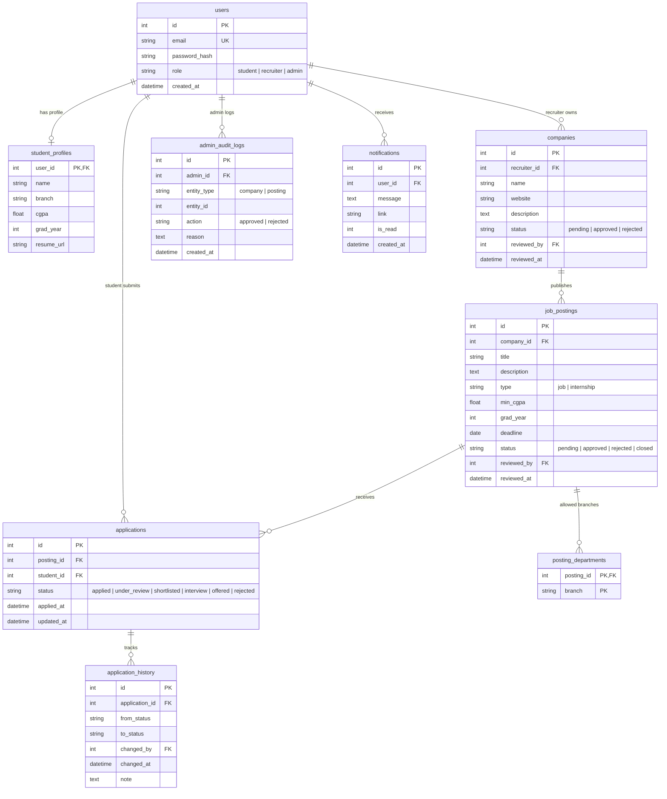

# 🎓 CampusPlace: Campus Placement & Internship Portal

> **Pitch / USP:** *A placement portal that explains itself.* Transparency for students, speed for recruiters, oversight for admins.

A role-based, three-tier, multi-page recruitment platform built with **Node.js, Express, EJS, and SQLite (`better-sqlite3`)**.

---

## 🌟 Key Highlights & Unique Selling Points (USPs)

1. **Eligibility Explainer + What-If Checker**:
   - Students see an instant breakdown of why they are or aren't eligible for a role before applying.
   - Interactive What-If simulator allows students to test hypothetical CGPA, branch, or graduation year changes without altering their actual profile.
2. **Transparent Match Score ("Recommended For You")**:
   - Rule-based algorithmic scoring (Branch 40% + CGPA margin up to 30% + Grad Year 15% + Deadline Urgency up to 15%).
   - Full point breakdown presented directly to students ("Why this match?").
3. **Recruiter Kanban Pipeline (Drag-and-Drop)**:
   - Visual candidate tracker using SortableJS with real-time status updates and status transition validation.
   - Table view with multi-select batch status updates executed inside database transactions.
4. **Application Timeline & Notifications**:
   - Every status shift records history with timestamp, actor, and feedback notes.
   - Bell notification system with real-time badge polling (`/api/notifications/unread-count`).
5. **Placement Cell Admin Dashboard & Analytics**:
   - Interactive Chart.js charts: placements by branch, applications per company, and average CGPA of offered students.
   - Transactional company and job posting review queues with audit logs and CSV export.

---

## 🔒 Permission Matrix & Role Boundaries

| Action | Student | Recruiter | Admin |
|:---|:---:|:---:|:---:|
| Register / Login | ✅ | ✅ | ✅ (Seeded) |
| Edit Own Student Profile | ✅ | ❌ | ❌ |
| Browse Approved & Active Postings | ✅ | ❌ | ✅ |
| Apply to Posting | ✅ (Server-gated) | ❌ | ❌ |
| Create & Edit Company Profile | ❌ | ✅ (Starts Pending) | ❌ |
| Create Postings | ❌ | ✅ (Approved Company only) | ❌ |
| View Applicants & Profiles | ❌ | ✅ (Own Postings only) | ❌ |
| Update Status (Single / Batch) | ❌ | ✅ (Own Postings only) | ❌ |
| Review Companies & Postings | ❌ | ❌ | ✅ |
| View Audit Logs & CSV Export | ❌ | ❌ | ✅ |
| Analytics Dashboard | ❌ | ❌ | ✅ |

*All authorization is strictly enforced on the server side: every route verifies session identity, role permissions, and resource ownership.*

---

## 👥 Mock Credentials (Out of the Box)

| Role | Email | Password | Details & Recommended Test Scenario |
|---|---|---|---|
| **Admin** | `admin@campus.edu` | `Admin@123` | Placement Cell Admin: manage queues, audit logs, analytics |
| **Recruiter 1** | `recruiter1@acme.com` | `Recruit@123` | Approved company (*Acme Technologies*), has postings & applicants |
| **Recruiter 2** | `recruiter2@globex.com` | `Recruit@123` | Pending company (*Globex Corporation*), cannot post until approved |
| **Student 1** | `student1@campus.edu` | `Student@123` | CGPA **9.1**, Branch **CSE** — high match scores, has received offers |
| **Student 2** | `student2@campus.edu` | `Student@123` | CGPA **6.5**, Branch **ECE** — triggers eligibility block notice |
| **Student 3** | `student3@campus.edu` | `Student@123` | CGPA **8.0**, Branch **CSE** — active applications in review/interview |

---

## 🛠 Prerequisites & Installation

- **Node.js** version 18+ (tested on Node 18, 20, 22, 24)
- **npm** version 9+

### Setup Steps

```bash
# 1. Clone the repository
git clone <repo-url>
cd placement-portal

# 2. Install dependencies
npm install

# 3. Configure environment
cp .env.example .env

# 4. Initialize database schema
npm run db:init

# 5. Populate sample seed data
npm run seed

# 6. Start the server
npm start
```

Open your browser at **`http://localhost:3000`**.

---

## 🧪 Testing Scenarios & Commands

### 1. Test Scenarios for Graders

- **Scenario A: Eligibility Gating**:
  1. Log in as `student2@campus.edu` (CGPA 6.5, ECE).
  2. Visit `/student/postings/2` (*Data Science Intern*, requires Min CGPA 8.0).
  3. Notice the red explanatory notice listing all reasons for ineligibility.
  4. Try to submit an application via HTTP POST (e.g. using curl or dev tools); the server rejects the submission and redirects back with flash error.
  5. Use the **What-If Checker** at the bottom of the page: enter CGPA 8.5 to see it report *"Would be eligible!"*.

- **Scenario B: Recruiter Workflow & Kanban**:
  1. Log in as `recruiter1@acme.com`.
  2. Navigate to **Postings** &rarr; **View Applicants** for *Software Engineer*.
  3. Toggle between **Table View** (with batch update) and **Kanban View**.
  4. Drag a candidate card to the next stage or update status in the table view.
  5. Attempt to access postings of another company (blocked server-side).

- **Scenario C: Admin Approval & Audit Logging**:
  1. Log in as `admin@campus.edu`.
  2. View **Companies** queue: approve *Globex Corporation*.
  3. View **Postings** queue: approve pending postings.
  4. Navigate to **Audit Logs**: verify the approval event, reviewer ID, timestamp, and optional reason.
  5. Click **Export to CSV** to download the audit log export.

### 2. Automated Test Commands

```bash
# Run unit & schema tests with Jest
npm test

# Run end-to-end integration journeys
node tests/e2e.js

# Run full Section 11 acceptance checklist verification
node tests/acceptance.js
```

### 3. Database Reset Command

```bash
# Drop all tables and re-populate fresh seed data with sequence reset:
npm run seed:reset
```

---

## 🗄️ Database Architecture & Entity Relationship (ER)



---

## 📂 Project Structure

```
placement-portal/
├── public/
│   ├── css/
│   │   └── style.css            # Responsive styling, badges, Kanban, alerts
│   └── js/
│       └── app.js              # Client-side notifications polling & helpers
├── src/
│   ├── app.js                  # Main Express app, middleware stack, error handling
│   ├── config/
│   │   └── index.js            # Environment config, constants, status transitions
│   ├── db/
│   │   ├── index.js            # SQLite database connection singleton
│   │   ├── schema.sql          # Complete DDL schema, constraints, and indexes
│   │   ├── init.js             # Schema initialization runner
│   │   └── seed.js             # Realistic mock data population script
│   ├── middleware/
│   │   ├── auth.js             # Session authentication guard
│   │   ├── requireRole.js      # Role-based authorization & 403 response
│   │   ├── csrf.js             # CSRF token protection
│   │   └── validate.js         # Input validation & error flashing
│   ├── services/
│   │   ├── eligibility.js      # Server-side eligibility gating & What-If checker
│   │   ├── matchScore.js       # Transparent match scoring algorithm
│   │   ├── applications.js     # Single/batch status transitions & history
│   │   ├── audit.js            # Transactional admin approvals & audit logging
│   │   └── notifications.js    # In-app notifications & unread counts
│   ├── routes/
│   │   ├── auth.js             # Register, login, logout
│   │   ├── student.js          # Profile, browse jobs, apply gate, what-if
│   │   ├── recruiter.js        # Company, postings CRUD, Kanban & applicants
│   │   ├── admin.js            # Dashboard, approvals, audit logs, CSV export
│   │   └── api.js              # JSON polling endpoints
│   └── views/
│       ├── layouts/main.ejs    # Master layout template
│       ├── partials/           # Navbar, flash alerts, footer
│       ├── auth/               # Login & Register views
│       ├── student/            # Dashboard, profile, postings, detail, applications
│       ├── recruiter/          # Company profile, postings, Kanban & applicants
│       ├── admin/              # Dashboard, pending queues, audit logs
│       └── errors/             # 403 Forbidden & 404 Not Found pages
├── tests/
│   ├── core.test.js            # Eligibility rules, transitions, match scores (Jest)
│   ├── db.test.js              # Schema integrity & UNIQUE constraint tests (Jest)
│   ├── permissions.test.js     # Role verification tests (Jest)
│   ├── e2e.js                  # End-to-end multi-role HTTP journey test
│   └── acceptance.js           # Spec Section 11 acceptance checklist verification
├── .env.example
├── package.json
└── README.md
```

---

## 🛡️ Security Hardening

- **Session Security**: Session cookies with `httpOnly: true`, customizable secret, secure flag in production.
- **CSRF Defense**: All POST, PUT, DELETE operations require a valid CSRF token.
- **Password Protection**: Passwords hashed with bcrypt (cost factor 10).
- **Helmet Middleware**: Configured with security headers for XSS, MIME sniffing, clickjacking protection.
- **SQL Injection Prevention**: 100% prepared statements via `better-sqlite3`.
- **Server-Side Authorization**: Every endpoint asserts role access and resource ownership.

---

## 📜 License

MIT License.
