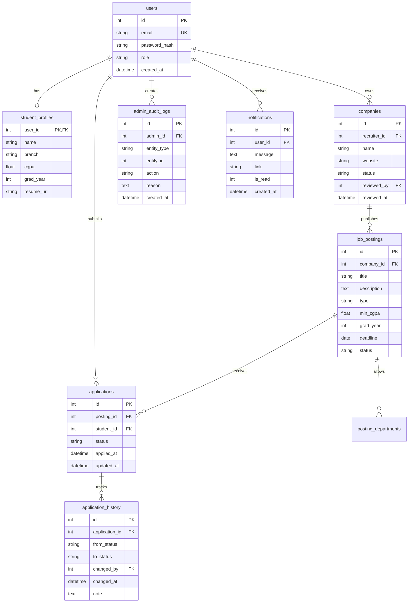

<div align="center">

<a name="top"></a>


<br>

<a href="https://github.com/Ashmit-Pathak018/placement-portal">

</a>
<a href="https://nodejs.org/">

</a>
<a href="https://expressjs.com/">

</a>
<a href="https://www.sqlite.org/">

</a>
<a href="https://jestjs.io/">

</a>
<a href="https://opensource.org/licenses/MIT">

</a>

<br><br>

<h3>A placement portal that explains itself.</h3>

<p>
<b>Transparency for students.</b>
&nbsp; · &nbsp;
<b>Speed for recruiters.</b>
&nbsp; · &nbsp;
<b>Oversight for admins.</b>
</p>

<br>


<br><br>

<a href="#-what-is-campusplace">What is it?</a>
&nbsp; • &nbsp;
<a href="#-why-campusplace">Why?</a>
&nbsp; • &nbsp;
<a href="#-features">Features</a>
&nbsp; • &nbsp;
<a href="#-architecture">Architecture</a>
&nbsp; • &nbsp;
<a href="#-quick-start">Quick Start</a>
&nbsp; • &nbsp;
<a href="#-testing">Testing</a>

</div>

---

# 🎓 What is CampusPlace?

**CampusPlace** is a role-based campus placement and internship platform built around one simple idea:

> **A recruitment system shouldn't just make decisions. It should explain them.**

Instead of turning placements into:

```text
Browse → Apply → Wait
```

CampusPlace creates a transparent workflow for:

```text
Student
   │
   ├── Understand eligibility
   ├── Understand match
   ├── Apply
   └── Track progress
              │
              ▼
        Recruiter Pipeline
              │
              ▼
        Admin Oversight
```

The platform connects three roles:

**🎓 Student · 🧑‍💼 Recruiter · 🏫 Placement Admin**

while enforcing authorization and resource ownership on the server.

---

# 💡 Why CampusPlace?

Traditional placement systems often create three problems:

| Role | Problem | CampusPlace Approach |
|:---|:---|:---|
| 🎓 Student | "Why am I not eligible?" | Eligibility explanation + What-If |
| 🧑‍💼 Recruiter | "Where is everyone in my pipeline?" | Kanban + batch updates |
| 🏫 Admin | "Who approved this and when?" | Audit logs + approval queues |

### The core philosophy

```text
                    ┌─────────────────────────┐
                    │       CAMPUSPLACE       │
                    └────────────┬────────────┘
                                 │
             ┌───────────────────┼───────────────────┐
             ▼                   ▼                   ▼
       ┌──────────┐        ┌──────────┐        ┌──────────┐
       │ STUDENT  │        │RECRUITER │        │  ADMIN   │
       └────┬─────┘        └────┬─────┘        └────┬─────┘
            │                   │                   │
            ▼                   ▼                   ▼
       Why am I?          Who moves next?      What happened?
       eligible?           What's pending?     Who approved it?
            │                   │                   │
            ▼                   ▼                   ▼
      Eligibility +        Kanban + batch      Approval +
       What-If             operations          audit logs
            │                   │                   │
            └───────────────────┼───────────────────┘
                                ▼
                       Transparent workflow
```

---

# ✨ Features

## 🎓 01 · Eligibility Explainer

Students don't just receive an **eligible / not eligible** result.

They get an explanation.

### Includes

- Instant eligibility breakdown
- Minimum CGPA checks
- Branch eligibility
- Graduation year validation
- Server-side application gating
- Human-readable reasons for rejection

### 🔮 What-If Checker

Students can experiment with hypothetical profiles:

> *"What if my CGPA was 8.5?"*

> *"What if I were from CSE?"*

> *"Would I qualify next year?"*

The system evaluates the hypothetical profile **without modifying the real student profile**.

---

## 🎯 02 · Transparent Match Score

CampusPlace doesn't just say:

> **91% Match**

and leave you wondering what that means.

The scoring model exposes the reasoning.

### Score breakdown

| Signal | Weight |
|:---|---:|
| Branch match | **40%** |
| CGPA margin | **up to 30%** |
| Graduation year | **15%** |
| Deadline urgency | **up to 15%** |

Example:

```text
┌───────────────────────────────────────┐
│          WHY THIS MATCH?              │
├───────────────────────────────────────┤
│                                       │
│  Branch match                 +40     │
│  CGPA margin                  +27     │
│  Graduation year              +15     │
│  Deadline urgency              +9     │
│                               ───     │
│  MATCH SCORE                 91/100   │
│                                       │
└───────────────────────────────────────┘
```

**The recommendation explains itself.**

---

## 🧑‍💼 03 · Recruiter Kanban

Recruiters get a visual candidate pipeline powered by **SortableJS**.

```text
┌────────────┐   ┌────────────┐   ┌────────────┐   ┌────────────┐
│   APPLIED  │   │   REVIEW   │   │ INTERVIEW  │   │   OFFERED  │
├────────────┤   ├────────────┤   ├────────────┤   ├────────────┤
│            │   │            │   │            │   │            │
│   Maya     │   │   Arjun    │   │   Riya     │   │   Dev      │
│   9.1 CSE  │   │   8.7 CSE  │   │   8.9 ECE  │   │   9.3 CSE  │
│            │   │            │   │            │   │            │
│   Zoya     │   │   Kabir    │   │   Neha     │   │            │
│   8.4 CSE  │   │   8.6 IT   │   │   8.8 CSE  │   │            │
│            │   │            │   │            │   │            │
└────────────┘   └────────────┘   └────────────┘   └────────────┘
```

### Recruiter tools

- Drag-and-drop candidate pipeline
- Kanban view
- Table view
- Multi-select batch updates
- Status transition validation
- Transactional updates
- Applicant ownership checks

---

## 🔔 04 · Application Timeline & Notifications

Every application has a history.

```text
Applied
   │
   ▼
Under Review
   │
   ▼
Shortlisted
   │
   ▼
Interview
   │
   ├──────────────► Rejected
   │
   ▼
Offered
```

Every transition records:

```text
FROM STATUS
     ↓
TO STATUS
     ↓
WHO CHANGED IT
     ↓
WHEN
     ↓
OPTIONAL NOTE
```

Notifications provide unread counts through:

```text
GET /api/notifications/unread-count
```

---

## 🏫 05 · Placement Cell Admin Dashboard

Admins get the control center.

### Approval workflows

- Company approvals
- Job posting approvals
- Rejection reasons
- Reviewer tracking

### Analytics

- Placements by branch
- Applications per company
- Average CGPA of offered students
- Interactive Chart.js visualizations

### Auditability

Every important administrative action can be traced through:

```text
Action
  │
  ├── Entity
  ├── Reviewer
  ├── Timestamp
  └── Reason
```

And yes:

**CSV export included.**

---

# 🔐 Permission Matrix

| Action | 🎓 Student | 🧑‍💼 Recruiter | 🏫 Admin |
|:--|:--:|:--:|:--:|
| Register / Login | ✓ | ✓ | ✓ |
| Edit own profile | ✓ | — | — |
| Browse postings | ✓ | — | ✓ |
| Apply | ✓ | — | — |
| Create company | — | ✓ | — |
| Create postings | — | ✓ | — |
| View applicants | — | ✓ | — |
| Update status | — | ✓ | — |
| Review companies | — | — | ✓ |
| Review postings | — | — | ✓ |
| Audit logs | — | — | ✓ |
| CSV export | — | — | ✓ |
| Analytics | — | — | ✓ |

### Server-side enforcement

The UI is **not** the security boundary.

Every protected operation follows:

```text
Request
   │
   ▼
Session Identity
   │
   ▼
Role Check
   │
   ▼
Resource Ownership
   │
   ▼
Validation
   │
   ▼
Database Operation
```

---

# 🧪 Demo Accounts

The project comes with seeded accounts so the entire workflow can be demonstrated immediately.

| Role | Email | Password | Demo Purpose |
|:---|:---|:---|:---|
| 🏫 **Admin** | `admin@campus.edu` | `Admin@123` | Approvals, audit, analytics |
| 🧑‍💼 **Recruiter 1** | `recruiter1@acme.com` | `Recruit@123` | Approved company + applicants |
| 🧑‍💼 **Recruiter 2** | `recruiter2@globex.com` | `Recruit@123` | Pending company workflow |
| 🎓 **Student 1** | `student1@campus.edu` | `Student@123` | CGPA 9.1 · CSE |
| 🎓 **Student 2** | `student2@campus.edu` | `Student@123` | CGPA 6.5 · ECE |
| 🎓 **Student 3** | `student3@campus.edu` | `Student@123` | CGPA 8.0 · CSE |

> These are intentionally seeded development credentials for demonstration and testing.

---

# ⚙️ Tech Stack

<div align="center">

| Layer | Technology |
|:---|:---|
| Runtime | **Node.js** |
| Backend | **Express.js** |
| Views | **EJS** |
| Database | **SQLite + better-sqlite3** |
| Styling | **CSS / Tailwind-based UI** |
| Drag & Drop | **SortableJS** |
| Analytics | **Chart.js** |
| Testing | **Jest + HTTP journeys** |
| Authentication | **Session-based auth** |
| Security | **Helmet + CSRF + bcrypt** |

</div>

---

# 🏗️ Architecture

```text
┌─────────────────────────────────────────────────────────────┐
│                         BROWSER                             │
│                   EJS + CSS + JavaScript                   │
└──────────────────────────────┬──────────────────────────────┘
                               │
                               │ HTTP
                               ▼
┌─────────────────────────────────────────────────────────────┐
│                    EXPRESS APPLICATION                      │
│                                                             │
│  Authentication                                             │
│        ↓                                                    │
│  CSRF Protection                                             │
│        ↓                                                    │
│  Input Validation                                            │
│        ↓                                                    │
│  Role Authorization                                          │
│        ↓                                                    │
│  Resource Ownership                                          │
│        ↓                                                    │
│  Routes                                                     │
│                                                             │
│   ┌──────────┐     ┌───────────┐     ┌──────────┐          │
│   │ Student  │     │ Recruiter │     │  Admin   │          │
│   └──────────┘     └───────────┘     └──────────┘          │
└──────────────────────────────┬──────────────────────────────┘
                               │
                               ▼
┌─────────────────────────────────────────────────────────────┐
│                         SERVICES                            │
│                                                             │
│ Eligibility │ Match Score │ Applications │ Audit │ Notify  │
└──────────────────────────────┬──────────────────────────────┘
                               │
                               ▼
┌─────────────────────────────────────────────────────────────┐
│                      SQLite DATABASE                        │
│                                                             │
│ Users │ Companies │ Postings │ Applications │ History      │
│ Notifications │ Audit Logs                                   │
└─────────────────────────────────────────────────────────────┘
```

---

# 🗄️ Database Model



---

# ⚡ Quick Start

### Requirements

- **Node.js 18+**
- **npm 9+**

### 1. Clone

```bash
git clone https://github.com/Ashmit-Pathak018/placement-portal.git
cd placement-portal
```

### 2. Install dependencies

```bash
npm install
```

### 3. Configure environment

```bash
cp .env.example .env
```

### 4. Initialize database

```bash
npm run db:init
```

### 5. Seed demo data

```bash
npm run seed
```

### 6. Start CampusPlace

```bash
npm start
```

Open:

**http://localhost:3000**

---

# 🧭 Hackathon Demo Flow

Want to demonstrate the entire system quickly?

```text
                 ┌─────────────────┐
                 │  LOGIN STUDENT  │
                 └────────┬────────┘
                          ▼
                ┌───────────────────┐
                │ Browse Postings   │
                └─────────┬─────────┘
                          ▼
                ┌───────────────────┐
                │ Eligibility       │
                │ Explanation       │
                └─────────┬─────────┘
                          ▼
                ┌───────────────────┐
                │ What-If Checker   │
                └─────────┬─────────┘
                          ▼
                ┌───────────────────┐
                │ Match Score       │
                └─────────┬─────────┘
                          ▼
                ┌───────────────────┐
                │ Apply             │
                └─────────┬─────────┘
                          │
                          ▼
                ┌───────────────────┐
                │ RECRUITER LOGIN   │
                └─────────┬─────────┘
                          ▼
                ┌───────────────────┐
                │ Kanban Pipeline   │
                └─────────┬─────────┘
                          ▼
                ┌───────────────────┐
                │ Status Transition │
                └─────────┬─────────┘
                          │
                          ▼
                ┌───────────────────┐
                │ ADMIN LOGIN       │
                └─────────┬─────────┘
                          ▼
                ┌───────────────────┐
                │ Approval + Audit  │
                └───────────────────┘
```

### The 3-minute pitch

**Student**

> "I don't just want to know whether I'm eligible. I want to know why."

Show:

**Eligibility → What-If → Match Score**

Then:

**Recruiter**

> "I don't want a spreadsheet. I want a pipeline."

Show:

**Kanban → Drag candidate → Batch update**

Then:

**Admin**

> "Every important decision should be traceable."

Show:

**Approval → Audit Log → CSV Export**

That's CampusPlace.

---

# 🧪 Testing

### Unit + schema tests

```bash
npm test
```

### End-to-end journey

```bash
node tests/e2e.js
```

### Acceptance checklist

```bash
node tests/acceptance.js
```

### Fresh database reset

```bash
npm run seed:reset
```

---

# 📁 Project Structure

```text
placement-portal/
│
├── public/
│   ├── css/
│   │   └── style.css
│   └── js/
│       └── app.js
│
├── src/
│   ├── app.js
│   │
│   ├── config/
│   │   └── index.js
│   │
│   ├── db/
│   │   ├── index.js
│   │   ├── schema.sql
│   │   ├── init.js
│   │   └── seed.js
│   │
│   ├── middleware/
│   │   ├── auth.js
│   │   ├── requireRole.js
│   │   ├── csrf.js
│   │   └── validate.js
│   │
│   ├── services/
│   │   ├── eligibility.js
│   │   ├── matchScore.js
│   │   ├── applications.js
│   │   ├── audit.js
│   │   └── notifications.js
│   │
│   ├── routes/
│   │   ├── auth.js
│   │   ├── student.js
│   │   ├── recruiter.js
│   │   ├── admin.js
│   │   └── api.js
│   │
│   └── views/
│       ├── layouts/
│       ├── partials/
│       ├── auth/
│       ├── student/
│       ├── recruiter/
│       ├── admin/
│       └── errors/
│
├── tests/
│   ├── core.test.js
│   ├── db.test.js
│   ├── permissions.test.js
│   ├── e2e.js
│   └── acceptance.js
│
├── .env.example
├── package.json
└── README.md
```

---

# 🛡️ Security

CampusPlace treats the browser as **untrusted**.

### Current hardening

- `httpOnly` session cookies
- Configurable session secret
- Secure cookies in production
- CSRF protection
- bcrypt password hashing
- Helmet security headers
- Prepared SQL statements through `better-sqlite3`
- Server-side role authorization
- Resource ownership checks
- Input validation
- Transactional application updates
- Transactional admin approvals
- Audit logging

The important distinction:

```text
Frontend restriction ≠ Security

Server-side authorization = Security boundary
```

---

# 🧠 Design Principles

### Explainability over mystery

If the system makes a recommendation, show the reasoning.

### Server-side enforcement

UI restrictions are helpful.

They are not security boundaries.

### Auditability

Important administrative actions should leave a trail.

### Transactional state changes

Application and approval workflows shouldn't end up half-updated.

### Separation of concerns

Routes handle HTTP concerns.

Services handle business logic.

The database layer handles persistence.

### Small delightful details

Because enterprise software doesn't have to look like it was designed in 2007.

---

# 🗺️ Roadmap

```text
FOUNDATION
[✓] Authentication
[✓] Role boundaries
[✓] Student profiles
[✓] Recruiter companies
[✓] Job postings

STUDENT EXPERIENCE
[✓] Eligibility engine
[✓] Eligibility explanations
[✓] What-If simulator
[✓] Match scoring
[✓] Application tracking
[✓] Notifications

RECRUITER EXPERIENCE
[✓] Applicant pipeline
[✓] Kanban
[✓] Table view
[✓] Batch updates
[✓] Status history

ADMIN EXPERIENCE
[✓] Approval queues
[✓] Audit logs
[✓] CSV export
[✓] Analytics

ENGINEERING
[✓] Input validation
[✓] CSRF protection
[✓] SQL parameterization
[✓] Permission tests
[✓] E2E testing
[✓] Acceptance tests

NEXT
[ ] Production deployment
[ ] Resume storage
[ ] Email notifications
[ ] Institution-wide configuration
[ ] Advanced recommendation models
```

---

# 🌱 The Idea Behind It

CampusPlace started as a placement portal.

The more we built, the more obvious the real problem became:

**Recruitment systems make people interact with decisions they don't understand.**

So the project became an attempt to make the workflow more transparent.

A student should understand:

> **Why am I eligible?**

A recruiter should understand:

> **Who needs attention?**

An administrator should understand:

> **Who changed what, and when?**

That is CampusPlace.

---

<div align="center">

## Built for campus recruitment.
### Designed around clarity.

<br>

<a href="#top">

</a>

<br><br>


</div>

<!--
CampusPlace
Campus Placement & Internship Portal
MIT License
-->
