<div align="center">

<a name="top"></a>


<h3>🎓 A placement portal that explains itself.</h3>


<br>

<a href="https://github.com/Ashmit-Pathak018/placement-portal"></a>
<a href="https://nodejs.org/"></a>
<a href="https://expressjs.com/"></a>
<a href="https://www.sqlite.org/"></a>
<a href="https://jestjs.io/"></a>
<a href="https://opensource.org/licenses/MIT"></a>

<br>


<br><br>

<b>🎓 Transparency for students</b> &nbsp;·&nbsp; <b>🧑‍💼 Speed for recruiters</b> &nbsp;·&nbsp; <b>🏫 Oversight for admins</b>

<br><br>

<a href="#-what-is-campusplace">What is it?</a> •
<a href="#-why-campusplace">Why?</a> •
<a href="#-features">Features</a> •
<a href="#-permission-matrix">Permissions</a> •
<a href="#%EF%B8%8F-architecture">Architecture</a> •
<a href="#-quick-start">Quick Start</a> •
<a href="#-testing">Testing</a> •
<a href="#-faq">FAQ</a>

</div>

<br>

---

## 📑 Table of Contents

<details>
<summary><b>Click to expand</b></summary>

1. [What is CampusPlace?](#-what-is-campusplace)
2. [Why CampusPlace?](#-why-campusplace)
3. [Features](#-features)
4. [Permission Matrix](#-permission-matrix)
5. [Demo Accounts](#-demo-accounts)
6. [Tech Stack](#%EF%B8%8F-tech-stack)
7. [Architecture](#%EF%B8%8F-architecture)
8. [Database Model](#%EF%B8%8F-database-model)
9. [Quick Start](#-quick-start)
10. [Demo Flow](#-demo-flow)
11. [Testing](#-testing)
12. [Project Structure](#-project-structure)
13. [Security](#%EF%B8%8F-security)
14. [Design Principles](#-design-principles)
15. [Roadmap](#%EF%B8%8F-roadmap)
16. [FAQ](#-faq)
17. [Contributing](#-contributing)

</details>

---

# 🎓 What is CampusPlace?

**CampusPlace** is a role-based campus placement and internship platform built around one idea:

> [!IMPORTANT]
> **A recruitment system shouldn't just make decisions. It should explain them.**

Most placement systems reduce everything to:

```text
Browse  →  Apply  →  Wait  →  ¯\_(ツ)_/¯
```

CampusPlace replaces the silence with a transparent workflow:

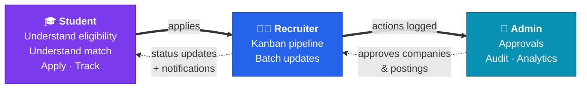

Three roles, one source of truth, with authorization and resource ownership enforced **on the server**, not the UI.

---

# 💡 Why CampusPlace?

| Role | The usual frustration | The CampusPlace answer |
|:---|:---|:---|
| 🎓 **Student** | *"Why am I not eligible?"* | Eligibility explanation + What-If simulator |
| 🧑‍💼 **Recruiter** | *"Where is everyone in my pipeline?"* | Kanban + batch updates |
| 🏫 **Admin** | *"Who approved this, and when?"* | Approval queues + immutable-style audit logs |

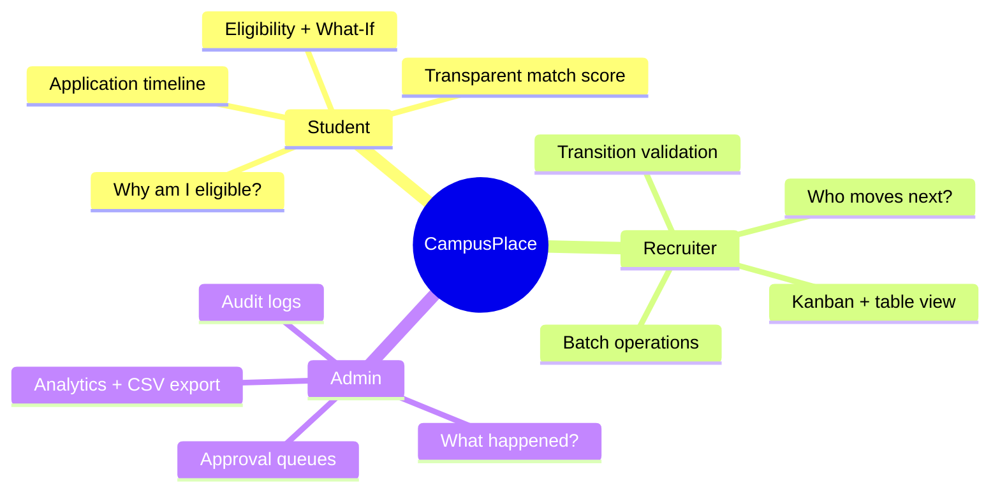

---

# ✨ Features

## 🎓 01 · Eligibility Explainer

Students don't get a bare **eligible / not eligible**. They get the *reasons*.

| Check | What the student sees |
|:---|:---|
| 📊 Minimum CGPA | Their CGPA vs. the posting's requirement |
| 🏛️ Branch eligibility | Whether their branch is on the allowed list |
| 🎓 Graduation year | Whether their batch matches |
| 🔒 Application gating | Enforced **server-side**, so no DOM-editing past it |
| 💬 Human-readable reasons | Plain-English explanations for every failed check |

### 🔮 What-If Checker

Students can try on a hypothetical profile:

> 💭 *"What if my CGPA was 8.5?"*
> 💭 *"What if I were from CSE?"*
> 💭 *"Would I qualify next year?"*

The engine evaluates the hypothetical **without touching the real profile**. It's a pure function, so there are no side effects.

---

## 🎯 02 · Transparent Match Score

CampusPlace never says just **"91% Match"** and walks away. Every point is accounted for.

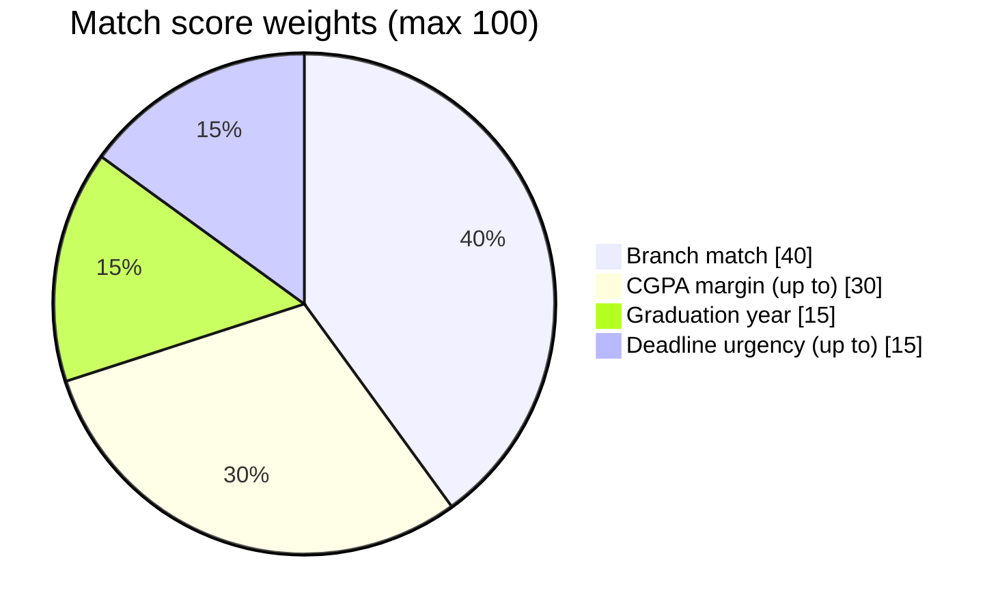

| Signal | Weight | How it's earned |
|:---|---:|:---|
| 🏛️ Branch match | **40** | Student's branch is allowed for the posting |
| 📊 CGPA margin | **up to 30** | How far the CGPA clears the minimum |
| 🎓 Graduation year | **15** | Batch matches the posting |
| ⏰ Deadline urgency | **up to 15** | Closer deadlines surface higher |

**A worked example:**

```text
┌───────────────────────────────────────┐
│           WHY THIS MATCH?             │
├───────────────────────────────────────┤
│                                       │
│   Branch match               +40      │
│   CGPA margin                +27      │
│   Graduation year            +15      │
│   Deadline urgency            +9      │
│                              ────     │
│   MATCH SCORE              91 / 100   │
│                                       │
└───────────────────────────────────────┘
```

> [!TIP]
> **The recommendation explains itself.** If a score looks off, the breakdown tells you exactly which signal moved it.

---

## 🧑‍💼 03 · Recruiter Kanban

A drag-and-drop candidate pipeline powered by **SortableJS**.

```text
┌────────────┐  ┌────────────┐  ┌────────────┐  ┌────────────┐
│  APPLIED   │  │   REVIEW   │  │ INTERVIEW  │  │  OFFERED   │
├────────────┤  ├────────────┤  ├────────────┤  ├────────────┤
│            │  │            │  │            │  │            │
│  Maya      │  │  Arjun     │  │  Riya      │  │  Dev       │
│  9.1 CSE   │  │  8.7 CSE   │  │  8.9 ECE   │  │  9.3 CSE   │
│            │  │            │  │            │  │            │
│  Zoya      │  │  Kabir     │  │  Neha      │  │            │
│  8.4 CSE   │  │  8.6 IT    │  │  8.8 CSE   │  │            │
│            │  │            │  │            │  │            │
└────────────┘  └────────────┘  └────────────┘  └────────────┘
```

| Tool | Detail |
|:---|:---|
| 🖱️ Drag & drop | Move candidates between stages |
| 🗂️ Dual views | Kanban **or** table, your call |
| ☑️ Batch updates | Multi-select and move many at once |
| 🚦 Transition validation | No jumping to illegal states |
| 🔁 Transactional writes | An update lands fully or not at all |
| 🛂 Ownership checks | Recruiters only see **their own** applicants |

---

## 🔔 04 · Application Timeline & Notifications

Every application carries its full history.

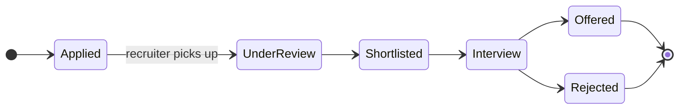

Every transition records **who, what, and when**:

```text
FROM STATUS  →  TO STATUS  →  CHANGED BY  →  TIMESTAMP  →  OPTIONAL NOTE
```

Notifications keep users in the loop, with unread counts available over the API:

```http
GET /api/notifications/unread-count
```

---

## 🏫 05 · Placement Cell Admin Dashboard

The control center.

<table>
<tr>
<td width="33%" valign="top">

### ✅ Approvals
- Company approvals
- Job posting approvals
- Rejection reasons
- Reviewer tracking

</td>
<td width="33%" valign="top">

### 📈 Analytics
- Placements by branch
- Applications per company
- Avg. CGPA of offered students
- Interactive **Chart.js** charts

</td>
<td width="33%" valign="top">

### 🧾 Auditability
- Entity + action recorded
- Reviewer identity
- Timestamp
- Reason
- 📥 **CSV export**

</td>
</tr>
</table>

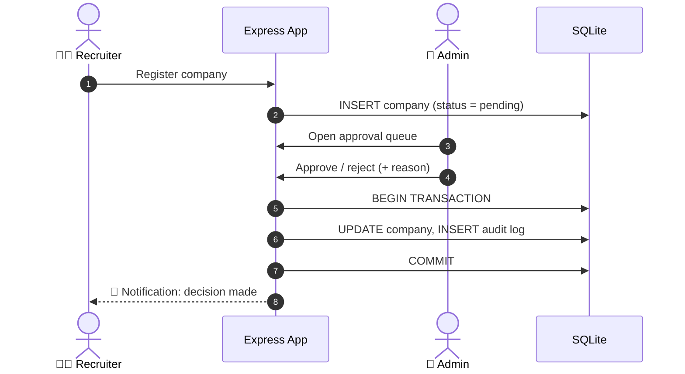

---

# 🔐 Permission Matrix

| Action | 🎓 Student | 🧑‍💼 Recruiter | 🏫 Admin |
|:--|:--:|:--:|:--:|
| Register / Login | ✅ | ✅ | ✅ |
| Edit own profile | ✅ | ➖ | ➖ |
| Browse postings | ✅ | ➖ | ✅ |
| Apply | ✅ | ➖ | ➖ |
| Create company | ➖ | ✅ | ➖ |
| Create postings | ➖ | ✅ | ➖ |
| View applicants | ➖ | ✅ | ➖ |
| Update status | ➖ | ✅ | ➖ |
| Review companies | ➖ | ➖ | ✅ |
| Review postings | ➖ | ➖ | ✅ |
| Audit logs | ➖ | ➖ | ✅ |
| CSV export | ➖ | ➖ | ✅ |
| Analytics | ➖ | ➖ | ✅ |

> [!NOTE]
> **The UI is not the security boundary.** Hiding a button is a courtesy. Every protected request is re-checked on the server.

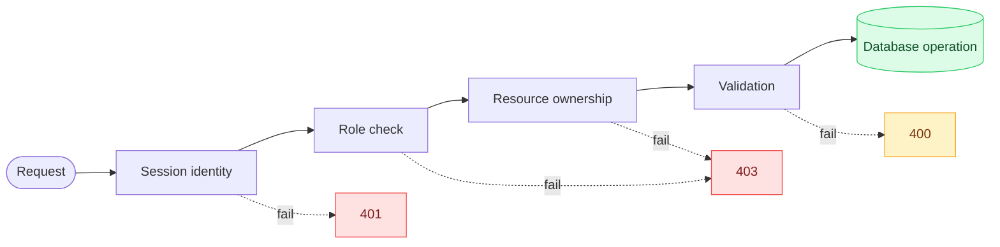

---

# 🧪 Demo Accounts

The project ships with seeded accounts so you can walk the entire workflow immediately.

| Role | Email | Password | Demo purpose |
|:---|:---|:---|:---|
| 🏫 **Admin** | `admin@campus.edu` | `Admin@123` | Approvals, audit, analytics |
| 🧑‍💼 **Recruiter 1** | `recruiter1@acme.com` | `Recruit@123` | Approved company + applicants |
| 🧑‍💼 **Recruiter 2** | `recruiter2@globex.com` | `Recruit@123` | Pending company workflow |
| 🎓 **Student 1** | `student1@campus.edu` | `Student@123` | CGPA 9.1 · CSE |
| 🎓 **Student 2** | `student2@campus.edu` | `Student@123` | CGPA 6.5 · ECE |
| 🎓 **Student 3** | `student3@campus.edu` | `Student@123` | CGPA 8.0 · CSE |

> [!WARNING]
> These are **development-only seeded credentials**. Never run `npm run seed` against a production database, and change or remove these accounts before any real deployment.

---

# ⚙️ Tech Stack

<div align="center">


</div>

| Layer | Technology |
|:---|:---|
| ⚙️ Runtime | **Node.js** |
| 🚂 Backend | **Express.js** |
| 🖼️ Views | **EJS** |
| 🗄️ Database | **SQLite + better-sqlite3** |
| 🎨 Styling | **CSS / Tailwind-based UI** |
| 🖱️ Drag & drop | **SortableJS** |
| 📊 Analytics | **Chart.js** |
| 🧪 Testing | **Jest + HTTP journeys** |
| 🔑 Auth | **Session-based** |
| 🛡️ Security | **Helmet + CSRF + bcrypt** |

---

# 🏗️ Architecture

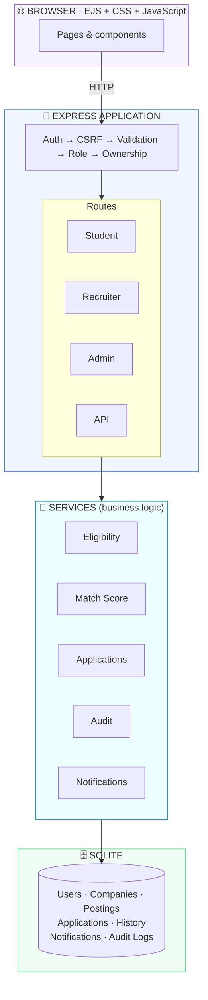

> [!NOTE]
> **Routes** handle HTTP. **Services** handle business rules. The **DB layer** handles persistence. Nothing leaks across those lines.

---

# 🗄️ Database Model

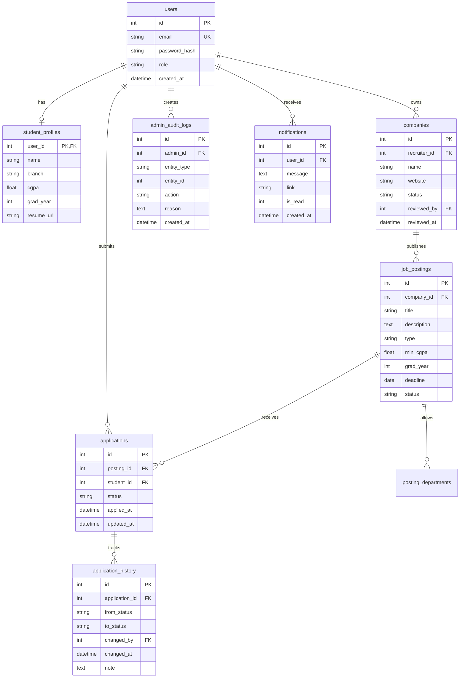

---

# ⚡ Quick Start

> [!NOTE]
> **Requirements:** Node.js **18+** and npm **9+**

```bash
# 1. Clone
git clone https://github.com/Ashmit-Pathak018/placement-portal.git
cd placement-portal

# 2. Install dependencies
npm install

# 3. Configure environment
cp .env.example .env

# 4. Initialize the database
npm run db:init

# 5. Seed demo data
npm run seed

# 6. Launch 🚀
npm start
```

Then open **http://localhost:3000** and log in with any [demo account](#-demo-accounts).

<details>
<summary><b>🧰 All npm scripts</b></summary>

<br>

| Command | What it does |
|:---|:---|
| `npm start` | Start CampusPlace |
| `npm run db:init` | Create the SQLite schema |
| `npm run seed` | Load demo users, companies, postings |
| `npm run seed:reset` | Wipe and re-seed a fresh database |
| `npm test` | Run unit + schema + permission tests |

</details>

<details>
<summary><b>🩹 Troubleshooting</b></summary>

<br>

- **`better-sqlite3` fails to install:** make sure you're on Node 18+; it ships native bindings, so a clean `npm install` on the correct Node version usually fixes it.
- **Login does nothing / 403 on forms:** your session or CSRF token is stale. Clear cookies for `localhost` and reload.
- **Weird data while demoing:** run `npm run seed:reset` for a clean slate.
- **Port 3000 already in use:** stop the other process or change the port in your `.env`.

</details>

---

# 🧭 Demo Flow

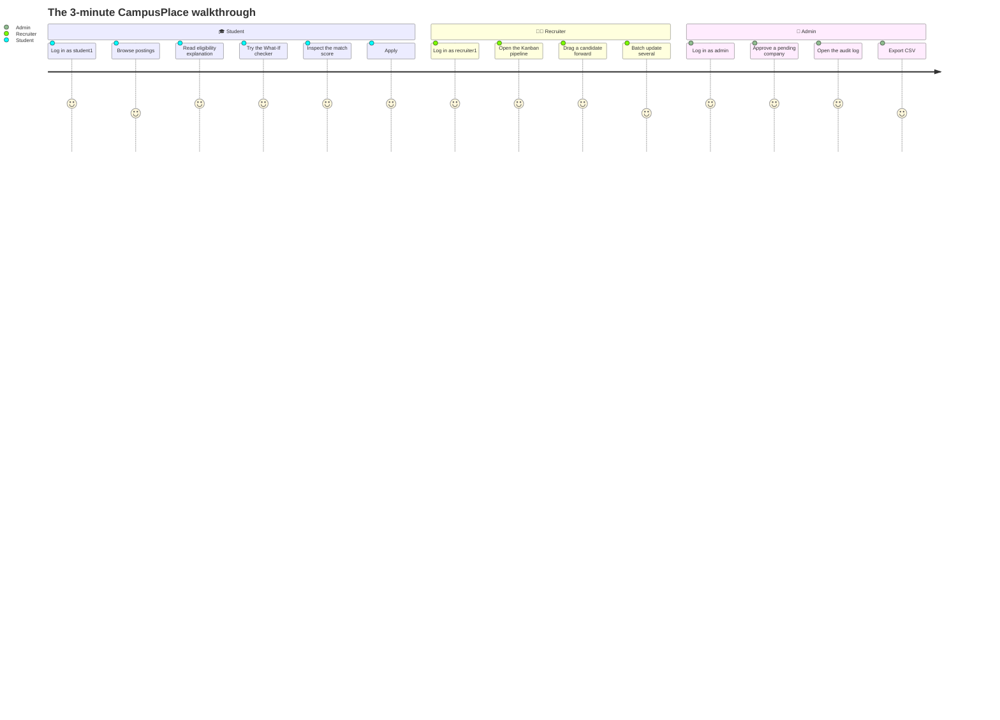

### 🎤 The 3-minute walkthrough

| Act | Say it | Show it |
|:---|:---|:---|
| 🎓 **Student** | *"I don't just want to know whether I'm eligible. I want to know **why**."* | Eligibility → What-If → Match Score |
| 🧑‍💼 **Recruiter** | *"I don't want a spreadsheet. I want a **pipeline**."* | Kanban → Drag candidate → Batch update |
| 🏫 **Admin** | *"Every important decision should be **traceable**."* | Approval → Audit Log → CSV Export |

**That's CampusPlace.**

---

# 🧪 Testing

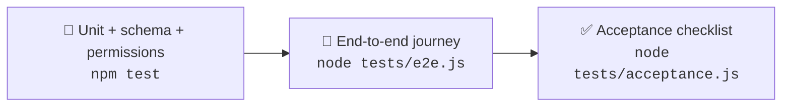

| Suite | Command | Covers |
|:---|:---|:---|
| 🧩 Unit / schema / permissions | `npm test` | `core`, `db`, and `permissions` tests |
| 🚶 End-to-end journey | `node tests/e2e.js` | Full student → recruiter → admin flow over HTTP |
| ✅ Acceptance | `node tests/acceptance.js` | Requirements checklist |
| 🔄 Fresh database | `npm run seed:reset` | Clean slate between runs |

---

# 📁 Project Structure

<details open>
<summary><b>Click to collapse</b></summary>

```text
placement-portal/
│
├── 📂 public/
│   ├── css/style.css
│   └── js/app.js
│
├── 📂 src/
│   ├── app.js
│   │
│   ├── 📂 config/        index.js
│   │
│   ├── 📂 db/            index.js · schema.sql · init.js · seed.js
│   │
│   ├── 📂 middleware/    auth.js · requireRole.js · csrf.js · validate.js
│   │
│   ├── 📂 services/      eligibility.js · matchScore.js · applications.js
│   │                     audit.js · notifications.js
│   │
│   ├── 📂 routes/        auth.js · student.js · recruiter.js
│   │                     admin.js · api.js
│   │
│   └── 📂 views/         layouts/ · partials/ · auth/ · student/
│                         recruiter/ · admin/ · errors/
│
├── 📂 tests/             core.test.js · db.test.js · permissions.test.js
│                         e2e.js · acceptance.js
│
├── .env.example
├── package.json
└── README.md
```

</details>

---

# 🛡️ Security

CampusPlace treats the browser as **untrusted**.

| 🔒 Control | Status |
|:---|:---:|
| `httpOnly` session cookies | ✅ |
| Configurable session secret | ✅ |
| Secure cookies in production | ✅ |
| CSRF protection | ✅ |
| bcrypt password hashing | ✅ |
| Helmet security headers | ✅ |
| Prepared SQL statements (`better-sqlite3`) | ✅ |
| Server-side role authorization | ✅ |
| Resource ownership checks | ✅ |
| Input validation | ✅ |
| Transactional application updates | ✅ |
| Transactional admin approvals | ✅ |
| Audit logging | ✅ |

```text
Frontend restriction      ≠  Security
Server-side authorization  =  Security boundary
```

---

# 🧠 Design Principles

| | Principle | In practice |
|:-:|:---|:---|
| 🔍 | **Explainability over mystery** | If the system recommends something, it shows its reasoning |
| 🛡️ | **Server-side enforcement** | UI restrictions are helpful, never a boundary |
| 🧾 | **Auditability** | Important admin actions leave a trail |
| 🔁 | **Transactional state changes** | Workflows never end up half-updated |
| 🧱 | **Separation of concerns** | Routes → Services → Database |
| ✨ | **Small delightful details** | Enterprise software doesn't have to look like it was designed in 2007 |

---

# 🗺️ Roadmap

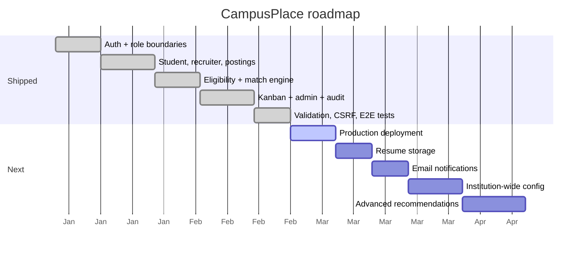

<details>
<summary><b>✅ Shipped</b></summary>

- [x] Authentication · Role boundaries · Student profiles · Recruiter companies · Job postings
- [x] Eligibility engine · Eligibility explanations · What-If simulator · Match scoring · Application tracking · Notifications
- [x] Applicant pipeline · Kanban · Table view · Batch updates · Status history
- [x] Approval queues · Audit logs · CSV export · Analytics
- [x] Input validation · CSRF protection · SQL parameterization · Permission tests · E2E tests · Acceptance tests

</details>

**🔭 Next up**

- [ ] Production deployment
- [ ] Resume storage
- [ ] Email notifications
- [ ] Institution-wide configuration
- [ ] Advanced recommendation models

> The Gantt dates above are illustrative; it's here to show the shape of the roadmap, not to promise a schedule.

---

# ❓ FAQ

<details>
<summary><b>Does the What-If checker change my real profile?</b></summary>

<br>

No. It evaluates a hypothetical profile and returns a result. Nothing is written to the database.

</details>

<details>
<summary><b>Can a recruiter see another company's applicants?</b></summary>

<br>

No. Every applicant query goes through server-side resource ownership checks, so a recruiter can only touch applications for their own postings, even if they craft requests by hand.

</details>

<details>
<summary><b>What happens if a status update fails halfway?</b></summary>

<br>

Nothing is half-applied. Application and approval updates run inside database transactions: either the whole change (status + history + audit) lands, or none of it does.

</details>

<details>
<summary><b>Can I hide a "Disallowed" button in the UI and call it secure?</b></summary>

<br>

That's exactly the trap this project avoids. The UI only hides things for convenience; the server independently enforces role, ownership, and validation on every request.

</details>

<details>
<summary><b>Why SQLite?</b></summary>

<br>

Zero-config, single-file, and a great fit for a campus-scale project like this. Everything runs through `better-sqlite3` with prepared statements.

</details>

---

# 🌱 The Idea Behind It

CampusPlace started as a placement portal.

The more we built, the clearer the real problem became:

> **Recruitment systems make people interact with decisions they don't understand.**

So the project turned into an attempt to make the workflow *legible*:

| 🎓 A student should understand | 🧑‍💼 A recruiter should understand | 🏫 An admin should understand |
|:---:|:---:|:---:|
| **Why am I eligible?** | **Who needs attention?** | **Who changed what, and when?** |

---

# 🤝 Contributing

Contributions, ideas, and bug reports are welcome.

1. 🍴 Fork the repo
2. 🌿 Create a branch: `git checkout -b feature/your-idea`
3. ✅ Make sure `npm test` and `node tests/e2e.js` pass
4. 📬 Open a pull request describing what changed and why

> [!TIP]
> Keep business logic in `src/services/`, keep routes thin, and add a permission test for any new protected route.

---

# 📜 License

Released under the [MIT License](https://opensource.org/licenses/MIT).

---

<div align="center">

## Built for campus recruitment.
### Designed around clarity.

<br>

<a href="https://github.com/Ashmit-Pathak018/placement-portal/stargazers">

</a>
<a href="#top">

</a>

<br><br>


</div>

<!--
CampusPlace
Campus Placement & Internship Portal
MIT License
-->
